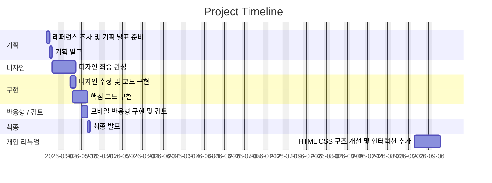

# 이스트소프트 과정 소개 사이트 리뉴얼 (1차 프로젝트)

이스트소프트 프론트엔드 개발자 부트캠프 과정 중 진행한 **1차 팀 프로젝트**입니다.

기존 교육 과정 소개 페이지를 분석하고, 정보 전달 중심의 구조를 사용자의 관심과 행동으로 자연스럽게 이어지는 **랜딩페이지 형태로 리뉴얼**했습니다.

프로젝트 종료 이후에는 당시 작성한 코드를 다시 검토하여, HTML 구조와 CSS 스타일, 반응형 UI 및 인터랙션을 중심으로 **개인 리뉴얼 작업을 추가 진행했습니다.**

---

## 프로젝트 정보

- 과정명: **[13기] 프론트엔드 개발자 부트캠프**
- 프로젝트 형태: **팀 프로젝트**
- 프로젝트 기간: **2026/04/30 ~ 2026/05/12**
- 개인 리뉴얼: **2026/09**
- 주요 기술: **HTML / CSS / JavaScript**
- 개발 방향: **HTML·CSS 중심 구현 / JavaScript 최소 사용**

---

## 빠른 링크

- **기획서 (Figma Slides)**  
  https://www.figma.com/deck/jq4CKvl6IA4QmoDVmZ9EFF

- **디자인 원본 (Figma)**  
  https://www.figma.com/design/cTespbRD3YaC5cl353Z5At/%EB%94%94%EC%9E%90%EC%9D%B8-%EC%8B%9C%EC%95%88?node-id=0-1&t=H6c5PgZvNAw2zCrh-1

- **배포 페이지**  
  https://s0y0ungk.github.io/est_fe_13_1st_project/

---

# 1. 프로젝트 개요

## 1.1 프로젝트 목표

기존의 정보 나열 중심 웹페이지에서 벗어나 사용자가 자연스럽게 페이지를 탐색하고, 과정에 대한 관심과 신청으로 이어질 수 있는 랜딩페이지를 구현하는 것을 목표로 했습니다.

주요 목표는 다음과 같습니다.

- 기존 정보 나열 중심의 구조를 **정보형 → 전환형 랜딩페이지 구조**로 개선
- 사용자가 단순히 콘텐츠를 읽는 것을 넘어 지원 및 관심 행동으로 이어질 수 있도록 UX 흐름 설계
- 페이지의 콘텐츠를 하나의 스토리라인처럼 구성
- 핵심 가치 전달 → 과정 정보 → 신뢰 형성 → 행동 유도(CTA) 흐름 설계
- 모바일 환경에서도 핵심 정보를 빠르게 파악할 수 있도록 반응형 구조 구현
- 불필요한 탐색 과정을 줄여 사용자가 필요한 정보를 빠르게 확인할 수 있도록 구성

---

# 2. 개인 리뉴얼

본 프로젝트는 부트캠프 과정 중 제작한 1차 팀 프로젝트를 기반으로 합니다.

프로젝트 종료 이후 당시 작성했던 코드를 다시 확인하면서, 학습 초기 단계에서 작성한 구조와 UI에서 부족했던 부분을 개선하기 위해 **개인적으로 추가 리뉴얼을 진행했습니다.**

기존 프로젝트의 콘텐츠와 전체 기획 방향은 유지하면서 코드 구조, 디자인, 반응형 UI 및 인터랙션을 중심으로 개선했습니다.

## 2.1 주요 리뉴얼 내용

### HTML 구조 개선

- 시맨틱 태그를 활용하여 페이지 구조 재정리
- 중복된 Header 및 Navigation 마크업 단순화
- 콘텐츠별 섹션 구조 정리
- 불필요한 wrapper 및 중복 요소 정리

### CSS 구조 개선

- 전체 레이아웃 및 여백 체계 재정리
- 타이포그래피 스타일 통일
- 카드 UI 및 섹션 디자인 개선
- 반복되는 디자인 값을 CSS 변수 중심으로 관리
- 기존 반응형 스타일 구조 단순화
- Desktop / Tablet / Mobile 환경별 레이아웃 개선

### 인터랙션 개선

JavaScript는 페이지의 핵심 기능 구현보다 **사용 경험을 보조하는 용도로 최소한으로 사용**했습니다.

적용한 기능은 다음과 같습니다.

- `IntersectionObserver` 기반 스크롤 등장 애니메이션
- 현재 보고 있는 섹션에 따른 Header Navigation 활성화
- 모바일 메뉴 선택 시 자동 닫힘
- 커리큘럼 가로 슬라이더 이동 버튼
- 스크롤 기반 UI 인터랙션

### JavaScript 의존도 최소화

JavaScript가 없어도 주요 콘텐츠를 확인할 수 있도록 구성했습니다.

특히 FAQ는 기존 JavaScript 방식 대신 HTML 기본 요소인

```html
<details>
  <summary>질문</summary>
  <p>답변</p>
</details>
```

구조를 활용하여 별도의 JavaScript 없이 동작하도록 개선했습니다.

이를 통해 프로젝트의 초기 목적에 맞게 **HTML과 CSS만으로 구현할 수 있는 부분은 최대한 HTML/CSS로 처리하고, JavaScript는 필요한 인터랙션을 보조하는 역할로 제한​**했습니다.

### 접근성 개선

- 시맨틱 HTML 구조 적용
- 버튼 및 링크 역할 구분
- 키보드 접근이 가능한 HTML 요소 활용
- 모션 최소화 설정 사용자를 고려한 `prefers-reduced-motion` 대응
- JavaScript 비활성화 상황에서도 주요 콘텐츠 접근 가능하도록 구성

---

# 3. 팀원

| 이름 | 역할 | 담당 섹션 | GitHub | 연락 |
| --- | --- | --- | --- | --- |
| 김소영 | 팀장 / UI 기획 / 디자인 | 회사소개 / 강사소개 / FAQ / CTA / Footer | [@s0y0ungk](https://github.com/s0y0ungk) | soyo2039@gmail.com |
| 최정원 | FE 리드 / UI 기획 / 디자인 | 혜택 / 이벤트 / PR 영역 | [RaeChoe](https://github.com/RaeChoe) | picasomati@gmail.com |
| 김정우 | UI 기획 / 디자인 | 문제제기 / 프로그램 소개 | [@casperjwk](https://github.com/casperjwk) | casperjwk@gmail.com |
| 김윤수 | UI 기획 / 디자인 | 콘텐츠 영역 / 접근성 | [@Noonting00](https://github.com/Noonting00) | kys5826911@gmail.com |
| 김찬희 | UI 기획 / 디자인 | Header / Hero | [@ckck912ck-lang](https://github.com/ckck912ck-lang) | ckck912ck@gmail.com |

---

# 4. 프로젝트 진행 과정

## 4.1 1일차 — 팀 구성 및 레퍼런스 조사

- [x] 팀장 선정
- [x] 팀명 선정
- [x] 기존 사이트 분석
- [x] 경쟁 및 레퍼런스 사이트 조사
- [x] 리뉴얼 방향 설정

## 4.2 2일차 — 스토리보드 및 스타일 가이드

- [x] Figma 스토리보드 작성
- [x] 콘텐츠 흐름 구성
- [x] 발표 자료 작성
- [x] 스타일 가이드 작성
- [x] 레이아웃 그리드 설정

## 4.3 3일차 — 디자인 분석 및 개발 환경 구성

- [x] Figma 디자인 분석
- [x] 레이아웃 및 색상 정리
- [x] 폰트 및 이미지 자산 정리
- [x] 페이지 구성 요소 정의
- [x] GitHub Repository 생성
- [x] 로컬 개발 환경 구성

## 4.4 4일차 — HTML 구조 구현

- [x] 시맨틱 태그를 활용한 HTML 구조 작성
- [x] Header / Main / Footer 기본 구조 구현
- [x] 페이지별 섹션 마크업
- [x] 이미지 및 콘텐츠 적용

## 4.5 5일차 — CSS 스타일링

- [x] Figma 기반 컬러 및 폰트 적용
- [x] Reset / Normalize CSS 적용
- [x] 공통 스타일 작성
- [x] Header / Hero / Main / Footer 스타일 구현
- [x] 섹션별 레이아웃 구현

## 4.6 6일차 — 세부 UI 및 품질 점검

- [x] 버튼 및 카드 UI 구현
- [x] 이미지 스타일 조정
- [x] Figma와 구현 화면 비교
- [x] 웹 표준 점검
- [x] 웹 접근성 점검
- [x] 코드 정리 및 주석 작성

## 4.7 7일차 — 반응형 및 배포

- [x] 모바일 반응형 구현
- [x] Chrome / Edge 크로스 브라우징 테스트
- [x] README 작성
- [x] GitHub Pages 배포
- [x] 최종 발표

---

# 5. 프로젝트 일정



---

# 6. 주요 구성

본 프로젝트는 별도의 페이지 이동보다 하나의 페이지 안에서 정보를 순차적으로 전달하는 **One Page Landing Page** 형태로 구성했습니다.

주요 콘텐츠 구성은 다음과 같습니다.

### Header

- 페이지 주요 섹션 Navigation
- 현재 섹션 Navigation 강조
- 모바일 메뉴

### Hero

- 교육 과정의 핵심 메시지 전달
- 첫 화면에서 주요 가치 및 과정 정보 제공
- CTA 영역 구성

### 문제 제기

- 사용자가 교육 과정에 관심을 가져야 하는 이유 제시
- 사용자의 상황과 고민을 기반으로 콘텐츠 구성

### 프로그램 소개

- 교육 과정의 특징 소개
- 학습 과정 및 커리큘럼 정보 제공

### 혜택

- 교육 과정 참여자가 얻을 수 있는 혜택 안내
- 카드 기반 UI로 주요 정보 구성

### 이벤트 / PR

- 과정 및 프로그램 관련 홍보 콘텐츠 제공

### 과정 진행

- 교육 과정의 전체 진행 흐름 안내
- 단계별 학습 프로세스 제공

### 수강생 후기

- 기존 참여자의 후기 콘텐츠 제공
- 실제 경험을 통한 신뢰 형성

### 회사 소개

- 교육 과정을 운영하는 기업 정보 제공

### 강사진 소개

- 강사 정보와 관련 경력 안내

### FAQ

- 교육 과정에 대한 주요 질문과 답변 제공
- `<details>` / `<summary>` 요소를 활용한 HTML 기반 아코디언 구현

### CTA

- 페이지 하단에서 지원 및 관심 행동 유도

### Footer

- 프로젝트 및 관련 정보 제공

---

# 7. 사용 기술

## Frontend

### HTML5

- 시맨틱 마크업
- `<header>`
- `<nav>`
- `<main>`
- `<section>`
- `<article>`
- `<footer>`
- `<details>`
- `<summary>`

### CSS3

- Flexbox
- CSS Grid
- CSS Variables
- Media Query
- Responsive Design
- Transition
- Animation
- Scroll Snap
- `prefers-reduced-motion`

### JavaScript

Vanilla JavaScript를 사용하며 필요한 인터랙션에만 제한적으로 적용했습니다.

주요 사용 기능:

- DOM 제어
- Event Listener
- `IntersectionObserver`
- `scrollBy()`
- `classList`
- 모바일 Navigation 제어

---

# 8. 개발 환경

| 구분 | 사용 기술 |
| --- | --- |
| Markup | HTML5 |
| Styling | CSS3 |
| Script | Vanilla JavaScript |
| Framework | None |
| Library | None |
| Backend | None |
| Database | None |
| Design | Figma |
| Version Control | Git / GitHub |
| Deployment | GitHub Pages |

프레임워크나 외부 UI 라이브러리를 사용하지 않고 **HTML, CSS, Vanilla JavaScript만을 사용하여 구현​**했습니다.

---

# 9. 프로젝트 구조

```text
1ST_PROJECT/
│
├── CSS/
│   ├── common.css
│   ├── flex-utility.css
│   ├── index.css
│   ├── normalize.css
│   ├── reset.css
│   ├── responsive.css
│   └── renewal.css
│
├── images/
│
├── js/
│   └── renewal.js
│
├── common.html
├── index.html
└── README.md
```

### CSS 구성

- `reset.css`
  - 브라우저 기본 스타일 초기화

- `normalize.css`
  - 브라우저별 스타일 차이 보정

- `flex-utility.css`
  - Flex 관련 공통 Utility 스타일

- `common.css`
  - 사이트 공통 스타일

- `index.css`
  - 메인 페이지 스타일

- `responsive.css`
  - 기존 반응형 스타일

- `renewal.css`
  - 개인 리뉴얼 과정에서 추가한 UI 및 반응형 스타일

### JavaScript 구성

- `renewal.js`
  - Scroll Reveal
  - 현재 Navigation 활성화
  - 모바일 메뉴 보조
  - Curriculum Slider

---

# 10. JavaScript 사용 원칙

본 프로젝트의 핵심 구현 목적은 HTML과 CSS에 대한 이해도를 높이는 것이었기 때문에 JavaScript 사용 범위를 최소화했습니다.

기본 원칙은 다음과 같습니다.

> HTML과 CSS만으로 구현할 수 있는 기능은 HTML과 CSS를 우선 사용하고, JavaScript는 사용성을 개선하는 보조 기능에만 활용한다.

JavaScript가 비활성화되어도 다음 기능은 정상적으로 사용할 수 있습니다.

- 페이지 콘텐츠 확인
- Anchor Navigation 이동
- FAQ 열기 / 닫기
- 주요 정보 탐색

JavaScript는 다음과 같은 Progressive Enhancement 용도로 활용했습니다.

- 스크롤 등장 애니메이션
- 현재 섹션 Navigation 표시
- 모바일 Navigation 보조
- Curriculum Slider 이동

---

# 11. 반응형 디자인

다양한 화면 환경에서 콘텐츠를 확인할 수 있도록 반응형 UI를 구성했습니다.

주요 대응 환경:

- Desktop
- Tablet
- Mobile

Media Query를 활용하여 화면 너비에 따라

- 콘텐츠 배치
- 카드 개수
- 텍스트 크기
- 여백
- Navigation 구조

등을 조정했습니다.

개인 리뉴얼 과정에서는 기존 반응형 CSS에서 여러 규칙이 중복으로 덮어쓰이던 부분을 정리하고, 보다 단순한 구조로 개선했습니다.

---

# 12. 접근성 및 웹 표준

프로젝트 구현 과정에서 웹 표준과 접근성을 함께 고려했습니다.

주요 적용 사항:

- 시맨틱 HTML 사용
- 이미지 `alt` 속성 적용
- 버튼과 링크 역할 구분
- 키보드 접근 가능한 HTML 기본 요소 활용
- FAQ에 `<details>` / `<summary>` 적용
- 색상 및 콘텐츠 가독성 고려
- 모션 감소 사용자를 위한 `prefers-reduced-motion` 적용
- JavaScript에 의존하지 않는 콘텐츠 구조 유지

---

# 13. 배포

## Production

https://s0y0ungk.github.io/est_fe_13_1st_project/

GitHub Pages를 통해 정적 웹사이트 형태로 배포했습니다.

---

# 14. 실행 방법

별도의 패키지 설치나 환경 변수 설정이 필요하지 않습니다.

## Repository Clone

```bash
git clone https://github.com/RaeChoe/ESTFE13_1st_Project_personal.git
```

```bash
cd ESTFE13_1st_Project_personal
```

## 실행

`index.html`을 브라우저에서 직접 실행하거나 VS Code의 Live Server 등을 이용하여 확인할 수 있습니다.

```text
index.html
```

별도의 Backend, Database, Package Manager는 사용하지 않습니다.

---

# 15. 제작 후기

첫 프로젝트를 진행하면서 단순히 화면을 디자인대로 구현하는 것보다, 사용자가 어떤 순서로 정보를 읽고 어떤 행동으로 이어지는지를 고려하는 것이 중요하다는 점을 배웠습니다.

특히 과정 소개, 혜택, 후기, FAQ 같은 콘텐츠들이 각각 독립적으로 존재하는 것이 아니라 하나의 사용자 흐름 안에서 연결되어야 한다는 점을 경험할 수 있었습니다.

또한 처음으로 팀원들과 하나의 페이지를 나누어 작업하면서 공통 스타일과 코드 작성 규칙을 맞추는 과정의 중요성을 배웠습니다.

이후 다른 프로젝트를 진행하며 HTML 구조, CSS 설계, 반응형 UI 및 JavaScript에 대한 이해도가 높아졌고, 첫 프로젝트의 코드를 다시 확인했을 때 개선할 수 있는 부분이 많이 보였습니다.

그래서 프로젝트를 그대로 보관하는 대신 기존 기획과 콘텐츠는 유지하면서 직접 다시 리뉴얼하는 작업을 진행했습니다.

리뉴얼 과정에서는 단순히 최신 디자인으로 변경하는 것보다 다음 부분에 집중했습니다.

- HTML 구조를 보다 의미 있게 구성하기
- 불필요하게 중복된 CSS 줄이기
- JavaScript에 의존하지 않아도 사용할 수 있는 구조 만들기
- 다양한 화면 크기에서도 자연스럽게 보이는 UI 구성하기
- 애니메이션과 인터랙션을 필요한 부분에만 사용하기

첫 프로젝트와 이후 리뉴얼 결과를 비교하면서, 단순히 새로운 기술을 사용하는 것뿐만 아니라 **기존 코드를 다시 읽고 문제점을 파악하여 개선하는 과정 역시 개발 역량의 중요한 부분이라는 점을 경험할 수 있었습니다.**

---

# 16. 향후 개선 사항

- 이미지 용량 및 로딩 성능 최적화
- 이미지 Lazy Loading 적용
- 키보드 Navigation 세부 접근성 개선
- Lighthouse 기반 성능 점검
- 웹 접근성 및 웹 표준 재검사
- 애니메이션 성능 최적화
- 모바일 UI 세부 조정
- 불필요한 기존 CSS 제거 및 구조 추가 리팩토링
- 배포 환경 개인 Repository 기준으로 이전
- Open Graph 및 기본 SEO Metadata 개선

---

# 17. 기획 / 디자인 문서

## 기획서

사용자 여정, 화면 흐름, 프로젝트 방향 및 실행 계획을 정리했습니다.

https://www.figma.com/deck/jq4CKvl6IA4QmoDVmZ9EFF

## 디자인 원본

컴포넌트, 컬러, 타이포그래피, 레이아웃 및 전체 UI 디자인을 확인할 수 있습니다.

https://www.figma.com/design/cTespbRD3YaC5cl353Z5At/%EB%94%94%EC%9E%90%EC%9D%B8-%EC%8B%9C%EC%95%88?node-id=382-156&t=H6c5PgZvNAw2zCrh-1

---

# 18. 버전 기록

## Team Project

- **v1.0 · 2026-04-28**
  - 프로젝트 기획 및 레퍼런스 조사

- **v1.1 · 2026-04-29**
  - 기획 발표
  - 프로젝트 방향 최종 확정

- **v1.2 · 2026-04-30**
  - 디자인 초안
  - 전체 UI 구조 설계 시작

- **v1.3 · 2026-05-05**
  - 디자인 최종 완성
  - 스타일 가이드 정리

- **v1.4 · 2026-05-06**
  - 디자인 수정 반영
  - HTML / CSS 구현 시작

- **v1.5 · 2026-05-07**
  - 핵심 레이아웃 및 주요 콘텐츠 구현

- **v1.6 · 2026-05-10**
  - 모바일 반응형 적용
  - 전반적인 UI 검토

- **v1.7 · 2026-05-12**
  - 최종 테스트
  - 프로젝트 발표

## Personal Renewal

- **v2.0 · 2026-09**
  - 프로젝트 종료 후 개인 리뉴얼 진행
  - 기존 HTML 시맨틱 구조 재정리
  - Header 및 Navigation 구조 단순화
  - 전체 레이아웃 및 UI 스타일 개선
  - CSS 및 반응형 구조 재정비
  - FAQ를 `<details>` / `<summary>` 기반으로 변경
  - JavaScript 사용 범위를 보조 인터랙션으로 최소화
  - `IntersectionObserver` 기반 Scroll Reveal 추가
  - 현재 섹션 Navigation 강조 기능 추가
  - Curriculum Slider 인터랙션 개선
  - `prefers-reduced-motion` 기반 모션 접근성 대응