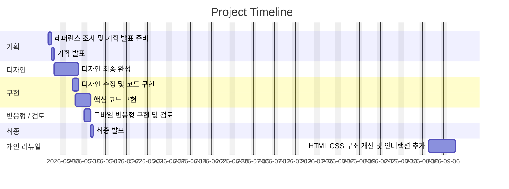

# 이스트소프트 과정 소개 사이트 리뉴얼 (1차 프로젝트)

이스트소프트 프론트엔드 개발자 부트캠프 과정 중 진행한 **1차 팀 프로젝트**입니다.

기존 교육 과정 소개 페이지를 분석하고, 정보 전달 중심의 구조를 사용자의 관심과 행동으로 자연스럽게 이어지는 **랜딩페이지 형태로 리뉴얼**했습니다.

프로젝트 종료 이후에는 당시 작성한 코드를 다시 검토하여, HTML 구조와 CSS 스타일, 반응형 UI 및 인터랙션을 중심으로 **개인 리뉴얼 작업을 추가 진행했습니다.**

---

## 프로젝트 정보

- 과정명: **[13기] 프론트엔드 개발자 부트캠프**

- 프로젝트 형태: **팀 프로젝트**

- 프로젝트 기간: **2026/04/30 ~ 2026/05/12**

- 개인 리뉴얼: **2026/09**

- 주요 기술: **HTML / CSS / JavaScript**

- 개발 방향: **HTML·CSS 중심 구현 / JavaScript 최소 사용**

---

## 빠른 링크

- **기획서 (Figma Slides)**  

  https://www.figma.com/deck/jq4CKvl6IA4QmoDVmZ9EFF

- **디자인 원본 (Figma)**  

  https://www.figma.com/design/cTespbRD3YaC5cl353Z5At/%EB%94%94%EC%9E%90%EC%9D%B8-%EC%8B%9C%EC%95%88?node-id=0-1&t=H6c5PgZvNAw2zCrh-1

- **배포 페이지**  

  https://s0y0ungk.github.io/est_fe_13_1st_project/

---

# 1. 프로젝트 개요

## 1.1 프로젝트 목표

기존의 정보 나열 중심 웹페이지에서 벗어나 사용자가 자연스럽게 페이지를 탐색하고, 과정에 대한 관심과 신청으로 이어질 수 있는 랜딩페이지를 구현하는 것을 목표로 했습니다.

주요 목표는 다음과 같습니다.

- 기존 정보 나열 중심의 구조를 **정보형 → 전환형 랜딩페이지 구조**로 개선

- 사용자가 단순히 콘텐츠를 읽는 것을 넘어 지원 및 관심 행동으로 이어질 수 있도록 UX 흐름 설계

- 페이지의 콘텐츠를 하나의 스토리라인처럼 구성

- 핵심 가치 전달 → 과정 정보 → 신뢰 형성 → 행동 유도(CTA) 흐름 설계

- 모바일 환경에서도 핵심 정보를 빠르게 파악할 수 있도록 반응형 구조 구현

- 불필요한 탐색 과정을 줄여 사용자가 필요한 정보를 빠르게 확인할 수 있도록 구성

---

# 2. 개인 리뉴얼

본 프로젝트는 부트캠프 과정 중 제작한 1차 팀 프로젝트를 기반으로 합니다.

프로젝트 종료 이후 당시 작성했던 코드를 다시 확인하면서, 학습 초기 단계에서 작성한 구조와 UI에서 부족했던 부분을 개선하기 위해 **개인적으로 추가 리뉴얼을 진행했습니다.**

기존 프로젝트의 콘텐츠와 전체 기획 방향은 유지하면서 HTML 구조, CSS 스타일, 반응형 UI, 접근성 및 사용자 인터랙션을 중심으로 개선했습니다.

## 2.1 리뉴얼 방향

리뉴얼 과정에서는 새로운 프레임워크로 프로젝트 전체를 다시 만드는 대신, 기존 HTML/CSS 기반 구조를 최대한 유지하면서 당시 작성한 코드를 직접 개선하는 방향을 선택했습니다.

특히 다음 원칙을 기준으로 작업했습니다.

- HTML과 CSS만으로 구현할 수 있는 기능은 HTML/CSS를 우선 사용
- JavaScript는 핵심 콘텐츠보다 사용자 경험을 보조하는 인터랙션에 활용
- 기존 팀 프로젝트의 구조와 콘텐츠는 유지하되 불필요한 중복 코드 정리
- Desktop / Tablet / Mobile 환경에서 일관된 사용자 경험 제공
- 기존 구현에서 불편했던 UI와 인터랙션을 직접 분석하여 개선
- 외부 라이브러리는 필요한 기능에 한해 최소한으로 사용

## 2.2 HTML 구조 개선

- 시맨틱 태그를 활용하여 전체 페이지 구조 재정리
- 중복된 Header 및 Navigation 마크업 단순화
- 콘텐츠별 Section 구조 정리
- 불필요한 wrapper 및 중복 요소 정리
- 버튼과 링크의 목적에 맞는 HTML 요소 사용
- FAQ 영역을 `<details>` / `<summary>` 기반으로 변경
- JavaScript가 비활성화되어도 주요 콘텐츠 접근이 가능하도록 구성

## 2.3 CSS 구조 및 UI 개선

- 전체 레이아웃과 섹션별 여백 체계 재정리
- 타이포그래피 크기와 간격 통일
- 공통 컬러, 여백, Radius 등을 CSS Variables로 관리
- 카드 UI 및 콘텐츠 계층 구조 개선
- Header 활성 상태 스타일 개선
- Hero 이미지와 배경 Gradient 표현 개선
- 문제 제기 카드 Hover 효과 완화
- 후기 카드의 너비와 높이를 통일하여 정렬 개선
- 후기 본문과 리뷰어 정보 간 여백 조정
- 프로세스 단계 설명의 정렬 및 가독성 개선
- 강사진 소개 영역을 기존 디자인 방향에 맞춰 재구성
- FAQ 질문과 답변 영역의 폭, 여백 및 시각적 계층 개선
- 기존 CSS와 리뉴얼 CSS가 충돌하던 스타일을 재정의하여 보완

## 2.4 반응형 UI 개선

기존 프로젝트의 반응형 CSS는 여러 Media Query에서 같은 속성을 반복적으로 덮어쓰는 구조가 많아 유지보수가 어려웠습니다.

개인 리뉴얼 과정에서는 기존 구조를 유지하면서 다음 부분을 중심으로 정리했습니다.

- Desktop / Tablet / Mobile 기준 레이아웃 재조정
- 화면 크기에 따른 카드 배치 변경
- 모바일 Header Navigation 개선
- Hero 이미지 및 텍스트 배치 조정
- 커리큘럼 슬라이더 모바일 대응
- 후기 카드 세로 배치 대응
- 강사진 소개 모바일 레이아웃 개선
- CTA 및 Sticky Button 모바일 화면 최적화
- FAQ의 모바일 글자 크기 및 내부 여백 조정

## 2.5 커리큘럼 Swiper 개선

기존 커리큘럼 영역은 직접 `transform` 값을 계산하여 슬라이드를 이동하는 방식으로 구현되어 있었습니다.

리뉴얼 과정에서 슬라이더 기능을 **Swiper.js 12** 기반으로 변경하여 인터랙션과 유지보수성을 개선했습니다.

주요 개선 사항:

- 기존 수동 슬라이드 이동 로직 제거
- Swiper Navigation 버튼 적용
- 마우스 드래그 및 모바일 Swipe 지원
- 현재 슬라이드와 상단 커리큘럼 단계 Progress 연동
- 현재 단계까지 진행선을 동적으로 표시
- 첫 단계 / 마지막 단계 버튼 비활성 상태 처리
- 커리큘럼 설명 영역 추가
- 슬라이더 내부 이미지 / 구분선 / 기술 목록 정렬 개선
- 기존 CSS와 겹치던 Progress 점선 및 Divider 스타일 충돌 수정

```js
new Swiper(".curriculum-swiper", {
  slidesPerView: 1,
  speed: 500,

  navigation: {
    prevEl: ".slider-button.prev",
    nextEl: ".slider-button.next",
  },

  on: {
    init(swiper) {
      updateCurriculumProgress(swiper);
    },

    slideChange(swiper) {
      updateCurriculumProgress(swiper);
    },
  },
});
```

Swiper의 `slideChange` 이벤트를 활용하여 현재 슬라이드와 상단 Progress UI가 함께 변경되도록 구성했습니다.

## 2.6 인터랙션 개선

JavaScript는 페이지의 핵심 콘텐츠 구현보다 **사용 경험을 보조하는 용도로 제한적으로 사용**했습니다.

적용한 기능은 다음과 같습니다.

- `IntersectionObserver` 기반 Scroll Reveal
- 현재 보고 있는 Section에 따른 Header Navigation 활성화
- Header Navigation 클릭 시 즉시 활성 상태 반영
- 모바일 메뉴 항목 선택 시 메뉴 자동 닫힘
- Swiper 기반 커리큘럼 Slider
- Slider와 커리큘럼 단계 Progress 동기화
- FAQ 열기 / 닫기 Animation
- 각 FAQ를 독립적으로 열고 닫을 수 있도록 구성

## 2.7 FAQ 인터랙션 개선

FAQ는 HTML 기본 요소인 `<details>`와 `<summary>`를 사용하여 기본적인 접근성과 구조를 유지했습니다.

```html
<details class="faq-item">
  <summary class="faq-question">질문</summary>
  <p class="faq-answer">답변</p>
</details>
```

기본 `<details>` 요소는 닫힐 때 콘텐츠가 즉시 사라지기 때문에, JavaScript의 Web Animations API를 활용하여 열림과 닫힘 모두 자연스럽게 전환되도록 개선했습니다.

주요 개선 사항:

- FAQ 열림 Animation 추가
- FAQ 닫힘 Animation 추가
- 여러 FAQ를 동시에 열 수 있도록 독립 동작
- 다른 FAQ를 열어도 기존 항목이 자동으로 닫히지 않도록 구성
- 답변 영역의 상하 여백 개선
- 긴 답변도 자연스럽게 표시될 수 있도록 높이를 동적으로 계산
- `prefers-reduced-motion` 환경에서는 Animation 없이 즉시 동작

## 2.8 Header Navigation 개선

기존 Navigation은 내부 링크 이동은 가능했지만, 사용자가 현재 보고 있는 Section을 직관적으로 확인하기 어려웠습니다.

리뉴얼 과정에서 현재 스크롤 위치를 기준으로 Navigation 상태를 동기화했습니다.

- 내부 링크 클릭 시 해당 Navigation 즉시 활성화
- Scroll 위치에 따라 현재 Section 자동 감지
- 활성 Navigation에 `active` Class 적용
- 활성 링크에 `aria-current="location"` 속성 적용
- 모바일 메뉴 선택 시 Navigation 자동 닫힘

## 2.9 Scroll Reveal

`IntersectionObserver`를 사용하여 페이지를 스크롤할 때 주요 콘텐츠가 자연스럽게 나타나는 효과를 추가했습니다.

적용 대상:

- Section Title
- 문제 제기 카드
- 혜택 카드
- 수강생 후기
- 프로세스 카드
- 강사진 정보
- FAQ

한 번 화면에 노출된 요소는 Observer에서 제거하여 불필요한 반복 감지를 줄였습니다.

## 2.10 접근성 개선

- 시맨틱 HTML 구조 적용
- 이미지 `alt` 속성 보완
- 버튼 및 링크 역할 구분
- `aria-label`을 통한 Slider Navigation 버튼 설명 제공
- 활성 Header Navigation에 `aria-current="location"` 적용
- FAQ에 `<details>` / `<summary>` 사용
- 키보드 접근 가능한 기본 HTML 요소 활용
- Swiper Keyboard Navigation 적용
- 모션 감소 사용자를 위한 `prefers-reduced-motion` 대응
- JavaScript 비활성화 상황에서도 주요 콘텐츠 접근 가능하도록 구성

## 2.11 리뉴얼 전 / 후 핵심 변화

| 항목       | 기존                    | 개인 리뉴얼                             |
| ---------- | ----------------------- | --------------------------------------- |
| Header     | 기본 Anchor Navigation  | 현재 Section 활성 상태 동기화           |
| Hero       | 이미지 중심 배치        | Gradient 및 UI 디테일 보완              |
| 문제 제기  | 강한 Hover Effect       | 자연스러운 Hover Effect                 |
| 커리큘럼   | 직접 구현한 수동 Slider | Swiper.js 기반 Slider                   |
| 진행 단계  | 정적 Progress UI        | 현재 Slide와 Progress 연동              |
| 후기       | 카드별 크기 차이        | 동일 너비 / 높이 정렬                   |
| 강사진     | 정보 가독성 부족        | 이미지 / 이름 / 역할 / 경력 구조 정리   |
| FAQ        | 기본 열기 / 닫기        | 독립 Accordion + 부드러운 Animation     |
| Navigation | 클릭 이동 중심          | 클릭 + Scroll 상태 동기화               |
| Animation  | 제한적인 효과           | IntersectionObserver 기반 Scroll Reveal |
| 접근성     | 기본 수준               | aria 속성 / Reduced Motion 등 추가      |

---

# 3. 팀원

| 이름                 | 역할                       | 담당 섹션                                | GitHub                                                | 연락                 |
| -------------------- | -------------------------- | ---------------------------------------- | ----------------------------------------------------- | -------------------- |
| 김&#8288;소&#8288;영 | 팀장 / UI 기획 / 디자인    | 회사소개 / 강사소개 / FAQ / CTA / Footer | [@s0y0ungk]\(https://github.com/s0y0ungk)             | soyo2039@gmail.com   |
| 최&#8288;정&#8288;원 | FE 리드 / UI 기획 / 디자인 | 혜택 / 이벤트 / PR 영역                  | [RaeChoe]\(https://github.com/RaeChoe)                | picasomati@gmail.com |
| 김&#8288;정&#8288;우 | UI 기획 / 디자인           | 문제제기 / 프로그램 소개                 | [@casperjwk]\(https://github.com/casperjwk)           | casperjwk@gmail.com  |
| 김&#8288;윤&#8288;수 | UI 기획 / 디자인           | 콘텐츠 영역 / 접근성                     | [@Noonting00]\(https://github.com/Noonting00)         | kys5826911@gmail.com |
| 김&#8288;찬&#8288;희 | UI 기획 / 디자인           | Header / Hero                            | [@ckck912ck-lang]\(https://github.com/ckck912ck-lang) | ckck912ck@gmail.com  |

---

# 4. 프로젝트 진행 과정

## 4.1 1일차 — 팀 구성 및 레퍼런스 조사

- [x] 팀장 선정

- [x] 팀명 선정

- [x] 기존 사이트 분석

- [x] 경쟁 및 레퍼런스 사이트 조사

- [x] 리뉴얼 방향 설정

## 4.2 2일차 — 스토리보드 및 스타일 가이드

- [x] Figma 스토리보드 작성

- [x] 콘텐츠 흐름 구성

- [x] 발표 자료 작성

- [x] 스타일 가이드 작성

- [x] 레이아웃 그리드 설정

## 4.3 3일차 — 디자인 분석 및 개발 환경 구성

- [x] Figma 디자인 분석

- [x] 레이아웃 및 색상 정리

- [x] 폰트 및 이미지 자산 정리

- [x] 페이지 구성 요소 정의

- [x] GitHub Repository 생성

- [x] 로컬 개발 환경 구성

## 4.4 4일차 — HTML 구조 구현

- [x] 시맨틱 태그를 활용한 HTML 구조 작성

- [x] Header / Main / Footer 기본 구조 구현

- [x] 페이지별 섹션 마크업

- [x] 이미지 및 콘텐츠 적용

## 4.5 5일차 — CSS 스타일링

- [x] Figma 기반 컬러 및 폰트 적용

- [x] Reset / Normalize CSS 적용

- [x] 공통 스타일 작성

- [x] Header / Hero / Main / Footer 스타일 구현

- [x] 섹션별 레이아웃 구현

## 4.6 6일차 — 세부 UI 및 품질 점검

- [x] 버튼 및 카드 UI 구현

- [x] 이미지 스타일 조정

- [x] Figma와 구현 화면 비교

- [x] 웹 표준 점검

- [x] 웹 접근성 점검

- [x] 코드 정리 및 주석 작성

## 4.7 7일차 — 반응형 및 배포

- [x] 모바일 반응형 구현

- [x] Chrome / Edge 크로스 브라우징 테스트

- [x] README 작성

- [x] GitHub Pages 배포

- [x] 최종 발표

---

# 5. 프로젝트 일정



---

# 6. 주요 구성

본 프로젝트는 별도의 페이지 이동보다 하나의 페이지 안에서 정보를 순차적으로 전달하는 **One Page Landing Page** 형태로 구성했습니다.

주요 콘텐츠 구성은 다음과 같습니다.

### Header

- 페이지 주요 섹션 Navigation

- 현재 섹션 Navigation 강조

- 모바일 메뉴

### Hero

- 교육 과정의 핵심 메시지 전달

- 첫 화면에서 주요 가치 및 과정 정보 제공

- CTA 영역 구성

### 문제 제기

- 사용자가 교육 과정에 관심을 가져야 하는 이유 제시

- 사용자의 상황과 고민을 기반으로 콘텐츠 구성

### 프로그램 소개

- 교육 과정의 특징 소개

- 학습 과정 및 커리큘럼 정보 제공

### 혜택

- 교육 과정 참여자가 얻을 수 있는 혜택 안내

- 카드 기반 UI로 주요 정보 구성

### 이벤트 / PR

- 과정 및 프로그램 관련 홍보 콘텐츠 제공

### 과정 진행

- 교육 과정의 전체 진행 흐름 안내

- 단계별 학습 프로세스 제공

### 수강생 후기

- 기존 참여자의 후기 콘텐츠 제공

- 실제 경험을 통한 신뢰 형성

### 회사 소개

- 교육 과정을 운영하는 기업 정보 제공

### 강사진 소개

- 강사 정보와 관련 경력 안내

### FAQ

- 교육 과정에 대한 주요 질문과 답변 제공

- `\<details>` / `\<summary>` 요소를 활용한 HTML 기반 아코디언 구현

### CTA

- 페이지 하단에서 지원 및 관심 행동 유도

### Footer

- 프로젝트 및 관련 정보 제공

---

# 7. 사용 기술

## Frontend

### HTML5

- 시맨틱 마크업
- `<header>`
- `<nav>`
- `<main>`
- `<section>`
- `<article>`
- `<footer>`
- `<details>`
- `<summary>`

### CSS3

- Flexbox
- CSS Grid
- CSS Variables
- Media Query
- Responsive Design
- Transition
- Animation
- Gradient
- `prefers-reduced-motion`

### JavaScript

Vanilla JavaScript를 사용하며 필요한 인터랙션에만 제한적으로 적용했습니다.

주요 사용 기능:

- DOM 제어
- Event Listener
- `IntersectionObserver`
- `requestAnimationFrame`
- Web Animations API
- `classList`
- `matchMedia`
- Header Scroll Navigation 동기화
- FAQ Animation 제어

### Library

- **Swiper.js 12**
  - 커리큘럼 Slider
  - Navigation
  - Touch / Swipe
  - Keyboard Navigation
  - Slide Change Event

---

# 8. 개발 환경

| 구분            | 사용 기술          |
| --------------- | ------------------ |
| Markup          | HTML5              |
| Styling         | CSS3               |
| Script          | Vanilla JavaScript |
| Slider Library  | Swiper.js 12       |
| Framework       | None               |
| Backend         | None               |
| Database        | None               |
| Design          | Figma              |
| Version Control | Git / GitHub       |
| Deployment      | GitHub Pages       |

프레임워크는 사용하지 않았으며, **HTML / CSS / Vanilla JavaScript를 중심으로 구현하고 커리큘럼 Slider에 한해 Swiper.js를 사용했습니다.**

---

# 9. 프로젝트 구조

```text
1ST_PROJECT/
│
├── CSS/
│   ├── common.css
│   ├── flex-utility.css
│   ├── index.css
│   ├── normalize.css
│   ├── reset.css
│   ├── responsive.css
│   └── renewal.css
│
├── images/
│
├── js/
│   ├── common.js
│   └── renewal.js
│
├── common.html
├── index.html
└── README.md
```

### CSS 구성

- `reset.css`
  - 브라우저 기본 스타일 초기화

- `normalize.css`
  - 브라우저별 스타일 차이 보정

- `flex-utility.css`
  - Flex 관련 공통 Utility 스타일

- `common.css`
  - 사이트 공통 스타일

- `index.css`
  - 기존 팀 프로젝트 메인 스타일

- `responsive.css`
  - 기존 팀 프로젝트 반응형 스타일

- `renewal.css`
  - 개인 리뉴얼 과정에서 추가한 UI, 반응형 및 Override 스타일

### JavaScript 구성

- `common.js`
  - 기존 프로젝트 공통 JavaScript

- `renewal.js`
  - Scroll Reveal
  - Header Navigation 활성 상태 동기화
  - 모바일 Navigation 보조
  - Swiper 초기화
  - Curriculum Progress 연동
  - FAQ 열기 / 닫기 Animation

---

# 10. JavaScript 사용 원칙

본 프로젝트의 핵심 구현 목적은 HTML과 CSS에 대한 이해도를 높이는 것이었기 때문에 JavaScript 사용 범위를 최소화했습니다.

기본 원칙은 다음과 같습니다.

> HTML과 CSS만으로 구현할 수 있는 기능은 HTML과 CSS를 우선 사용하고, JavaScript는 사용성을 개선하는 보조 기능에 활용한다.

JavaScript가 비활성화되어도 다음 기능은 사용할 수 있도록 콘텐츠 구조를 구성했습니다.

- 페이지 콘텐츠 확인
- Anchor Navigation 이동
- FAQ 기본 열기 / 닫기
- 주요 정보 탐색

JavaScript는 다음과 같은 Progressive Enhancement 용도로 활용했습니다.

- Scroll Reveal Animation
- 현재 Section Navigation 표시
- 모바일 Navigation 보조
- Curriculum Swiper 초기화
- Curriculum Progress 동기화
- FAQ 열기 / 닫기 Animation

외부 Library는 복잡한 Slider 동작을 직접 구현하는 대신 검증된 기능을 활용하기 위해 **Swiper.js만 제한적으로 사용했습니다.**

---

# 11. 반응형 디자인

다양한 화면 환경에서 콘텐츠를 확인할 수 있도록 반응형 UI를 구성했습니다.

주요 대응 환경:

- Desktop

- Tablet

- Mobile

Media Query를 활용하여 화면 너비에 따라

- 콘텐츠 배치

- 카드 개수

- 텍스트 크기

- 여백

- Navigation 구조

등을 조정했습니다.

개인 리뉴얼 과정에서는 기존 반응형 CSS에서 여러 규칙이 중복으로 덮어쓰이던 부분을 정리하고, 보다 단순한 구조로 개선했습니다.

---

# 12. 접근성 및 웹 표준

프로젝트 구현 과정에서 웹 표준과 접근성을 함께 고려했습니다.

주요 적용 사항:

- 시맨틱 HTML 사용

- 이미지 `alt` 속성 적용

- 버튼과 링크 역할 구분

- 키보드 접근 가능한 HTML 기본 요소 활용

- FAQ에 `\<details>` / `\<summary>` 적용

- 색상 및 콘텐츠 가독성 고려

- 모션 감소 사용자를 위한 `prefers-reduced-motion` 적용

- JavaScript에 의존하지 않는 콘텐츠 구조 유지

---

# 13. 배포

## Production

https://s0y0ungk.github.io/est_fe_13_1st_project/

GitHub Pages를 통해 정적 웹사이트 형태로 배포했습니다.

---

# 14. 실행 방법

별도의 패키지 설치나 환경 변수 설정이 필요하지 않습니다.

## Repository Clone

```bash

git clone https://github.com/RaeChoe/ESTFE13_1st_Project_personal.git

```

```bash

cd ESTFE13_1st_Project_personal

```

## 실행

`index.html`을 브라우저에서 직접 실행하거나 VS Code의 Live Server 등을 이용하여 확인할 수 있습니다.

```text

index.html

```

별도의 Backend, Database, Package Manager는 사용하지 않습니다.

---

# 15. 제작 후기

첫 프로젝트를 진행하면서 단순히 화면을 디자인대로 구현하는 것보다, 사용자가 어떤 순서로 정보를 읽고 어떤 행동으로 이어지는지를 고려하는 것이 중요하다는 점을 배웠습니다.

특히 과정 소개, 혜택, 후기, FAQ 같은 콘텐츠들이 각각 독립적으로 존재하는 것이 아니라 하나의 사용자 흐름 안에서 연결되어야 한다는 점을 경험할 수 있었습니다.

또한 처음으로 팀원들과 하나의 페이지를 나누어 작업하면서 공통 스타일과 코드 작성 규칙을 맞추는 과정의 중요성을 배웠습니다.

이후 다른 프로젝트를 진행하며 HTML 구조, CSS 설계, 반응형 UI 및 JavaScript에 대한 이해도가 높아졌고, 첫 프로젝트의 코드를 다시 확인했을 때 개선할 수 있는 부분이 많이 보였습니다.

그래서 프로젝트를 그대로 보관하는 대신 기존 기획과 콘텐츠는 유지하면서 직접 다시 리뉴얼하는 작업을 진행했습니다.

리뉴얼 과정에서는 단순히 최신 디자인으로 변경하는 것보다 다음 부분에 집중했습니다.

- HTML 구조를 보다 의미 있게 구성하기

- 불필요하게 중복된 CSS 줄이기

- JavaScript에 의존하지 않아도 사용할 수 있는 구조 만들기

- 다양한 화면 크기에서도 자연스럽게 보이는 UI 구성하기

- 애니메이션과 인터랙션을 필요한 부분에만 사용하기

첫 프로젝트와 이후 리뉴얼 결과를 비교하면서, 단순히 새로운 기술을 사용하는 것뿐만 아니라 **기존 코드를 다시 읽고 문제점을 파악하여 개선하는 과정 역시 개발 역량의 중요한 부분이라는 점을 경험할 수 있었습니다.**

---

# 16. 향후 개선 사항

- 이미지 용량 및 로딩 성능 최적화

- 이미지 Lazy Loading 적용

- 키보드 Navigation 세부 접근성 개선

- Lighthouse 기반 성능 점검

- 웹 접근성 및 웹 표준 재검사

- 애니메이션 성능 최적화

- 모바일 UI 세부 조정

- 불필요한 기존 CSS 제거 및 구조 추가 리팩토링

- 배포 환경 개인 Repository 기준으로 이전

- Open Graph 및 기본 SEO Metadata 개선

---

# 17. 기획 / 디자인 문서

## 기획서

사용자 여정, 화면 흐름, 프로젝트 방향 및 실행 계획을 정리했습니다.

https://www.figma.com/deck/jq4CKvl6IA4QmoDVmZ9EFF

## 디자인 원본

컴포넌트, 컬러, 타이포그래피, 레이아웃 및 전체 UI 디자인을 확인할 수 있습니다.

https://www.figma.com/design/cTespbRD3YaC5cl353Z5At/%EB%94%94%EC%9E%90%EC%9D%B8-%EC%8B%9C%EC%95%88?node-id=382-156&t=H6c5PgZvNAw2zCrh-1

---

# 18. 버전 기록

## Team Project

- **v1.0 · 2026-04-28**

  - 프로젝트 기획 및 레퍼런스 조사

- **v1.1 · 2026-04-29**

  - 기획 발표

  - 프로젝트 방향 최종 확정

- **v1.2 · 2026-04-30**

  - 디자인 초안

  - 전체 UI 구조 설계 시작

- **v1.3 · 2026-05-05**

  - 디자인 최종 완성

  - 스타일 가이드 정리

- **v1.4 · 2026-05-06**

  - 디자인 수정 반영

  - HTML / CSS 구현 시작

- **v1.5 · 2026-05-07**

  - 핵심 레이아웃 및 주요 콘텐츠 구현

- **v1.6 · 2026-05-10**

  - 모바일 반응형 적용

  - 전반적인 UI 검토

- **v1.7 · 2026-05-12**

  - 최종 테스트

  - 프로젝트 발표

## Personal Renewal

- **v2.0 · 2026-09**
  - 프로젝트 종료 후 개인 리뉴얼 진행
  - 기존 HTML 시맨틱 구조 재정리
  - Header 및 Navigation 구조 단순화
  - 전체 레이아웃 및 UI 스타일 개선
  - CSS 및 반응형 구조 재정비
  - Hero 이미지 및 Gradient 스타일 개선
  - 문제 제기 Hover Effect 개선
  - 후기 카드 레이아웃 및 간격 정리
  - 강사진 소개 디자인 및 정보 구조 개선
  - FAQ를 `<details>` / `<summary>` 기반으로 변경
  - FAQ 독립 열기 / 닫기 Animation 추가
  - JavaScript 사용 범위를 보조 인터랙션 중심으로 제한
  - `IntersectionObserver` 기반 Scroll Reveal 추가
  - 현재 Section에 따른 Header Navigation 활성화
  - `aria-current` 기반 Navigation 접근성 보완
  - 커리큘럼 Slider를 Swiper.js 12 기반으로 변경
  - Swiper와 커리큘럼 Progress 상태 연동
  - Slider Navigation / Swipe / Keyboard 제어 지원
  - `prefers-reduced-motion` 기반 모션 접근성 대응
